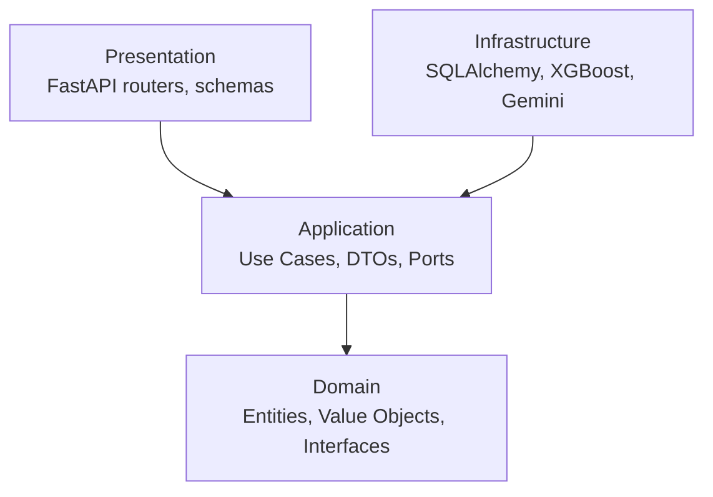

# Financial Risk Intelligence Platform

A production-grade credit/market risk intelligence API built with FastAPI, PostgreSQL,
XGBoost, and the Gemini API, following Clean Architecture and SOLID principles.

## Tech Stack

- **API**: FastAPI (async)
- **Database**: PostgreSQL via SQLAlchemy 2.0 (async) + Alembic migrations
- **Data/ML**: Pandas, XGBoost, scikit-learn
- **LLM**: Gemini API (risk narrative generation)
- **Testing**: Pytest
- **Packaging/Runtime**: Python + PostgreSQL

## Architecture

Dependencies point inward. Outer layers may depend on inner layers; inner layers never
depend on outer layers. Inner layers define interfaces ("ports"); outer layers provide
implementations ("adapters"), wired together at runtime via a DI container.



## Project Structure

```
src/risk_platform/
├── main.py                 # Composition root: builds the FastAPI app
├── core/                    # Settings, logging, DI container, base exceptions
├── domain/                  # Entities, value objects, repository/service interfaces
│   ├── entities/
│   ├── value_objects/
│   ├── repositories/        # abstract ports
│   ├── services/            # abstract ports
│   └── exceptions/
├── application/              # Use cases orchestrating the domain
│   ├── use_cases/
│   ├── dto/
│   └── interfaces/           # ports for ML, LLM, unit of work, etc.
├── infrastructure/            # Concrete adapters (frameworks & drivers)
│   ├── database/              # SQLAlchemy models, repositories, session/UoW
│   ├── ml/                    # feature engineering, XGBoost training/inference, model registry
│   └── external/gemini/       # Gemini API client adapter
├── presentation/               # FastAPI routers, schemas, DI-based dependencies
│   ├── api/v1/routers/
│   ├── api/v1/schemas/
│   └── middleware/
└── shared/                     # generic, business-agnostic utilities

tests/
├── unit/            # domain + application tests, isolated via fakes/mocks
├── integration/     # real DB / API test-client tests
└── conftest.py

scripts/     # seed_db.py, train_model.py, run_migrations.py (ops entry points)
notebooks/   # exploratory analysis; nothing imported by the app
```

## Folder Responsibilities

| Folder | Responsibility | Depends on |
|---|---|---|
| `domain/` | Business entities, value objects, and abstract interfaces. The stable core. | Nothing |
| `application/` | Use cases orchestrating domain logic; defines ports for external needs | `domain/` |
| `infrastructure/` | Concrete implementations: DB, ML, external APIs | `application/`, `domain/` (via ports) |
| `presentation/` | HTTP layer: routers, request/response schemas, DI wiring | `application/` |
| `core/` | Settings, logging, DI container, shared exception base classes | used by all layers |
| `shared/` | Generic, business-agnostic helpers | none (leaf utility) |
| `tests/` | Unit tests (fast, isolated) and integration tests (real DB/API) | mirrors `src/` |

## Status

Structure only — no business logic implemented yet. Domain entities, use cases,
repositories, ML pipelines, and API routes are added incrementally in later phases.

## Getting Started

```bash
python -m venv .venv
.venv\Scripts\activate       # Windows
pip install -e ".[dev]"
cp .env.example .env
install PostgreSQL locally and create the `risk_platform` user/database
pytest
```

For local development, use a PostgreSQL server on `localhost:5432` and keep `DATABASE_URL` set in `.env`.
